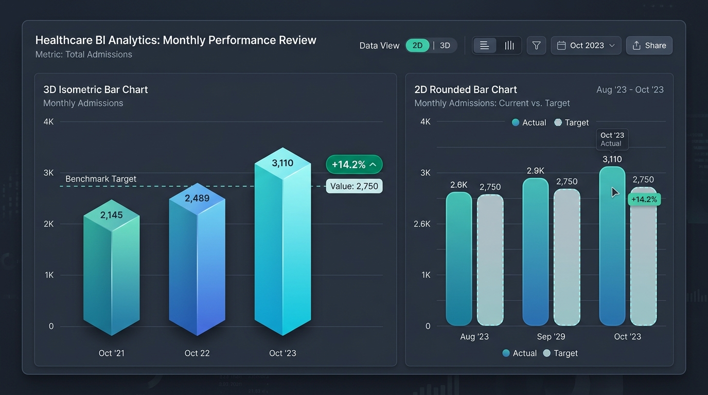
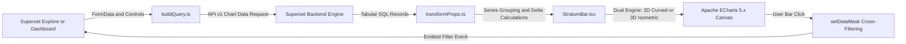

# StratumBar - 3D Isometric & Advanced Bar Chart Plugin for Apache Superset

[](https://opensource.org/licenses/Apache-2.0)
[](https://superset.apache.org/)
[](https://www.typescriptlang.org/)
[](https://echarts.apache.org/)
[](#)

**StratumBar** is an enterprise-grade visualization plugin for **Apache Superset** that expands the analytical and aesthetic capabilities of the standard bar chart (`echarts_timeseries_bar`). It introduces a **dual rendering engine (Modern 2D Curved & Volumetric 3D Isometric)**, reference **Benchmark Target Lines**, automated **Percentage Variance Badges (Delta %)**, an **Interactive Runtime Control Toolbar**, and native **Dashboard Cross-Filtering (`setDataMask`)**.

---

## 📸 Visual Preview



*Figure 1: Volumetric 3D Isometric view with directional shading, depth extrusion, reference benchmark line, and percentage delta badges.*

---

## 🌟 Key Features

### 1. 🧊 Dual Rendering Engine: Modern 2D & Volumetric 3D Isometric
- **Volumetric 3D Isometric Projection**: Renders 3D columns using isometric vector mathematics with three distinct lighted faces (front, side, and top cap) and directional lighting gradients.
- **Zero WebGL Overhead**: Built on Apache ECharts' native 2D Canvas engine, delivering smooth 60 fps performance with zero WebGL context crashes or memory exhaustion on dense multi-chart dashboards.
- **Ambient Ground Shadows**: Realistic soft ambient drop shadows projected beneath each 3D column, anchoring bars to the baseline plane.
- **Modern 2D Styling**: Configurable corner radii (`barBorderRadius`), vertical and horizontal color gradients, and optional full-height track background guides.

### 2. 🎯 Benchmark Targets & Percentage Variance (Delta %)
- **Dynamic Reference Lines**: Configure target benchmarks from a fixed numeric value, dynamic statistical calculations (**Average** or **Median** across current series), or a dedicated **Target Metric** column from your SQL query.
- **Smart Delta % Badges**: Automatic mathematical evaluation of percentage deviation `((Value - Target) / Target) * 100` displayed directly in tooltips and bar labels.
- **Configurable Variance Polarity**:
 - *Normal ("Higher is Better")*: Positive gains are highlighted in green; drops appear in red.
 - *Inverted ("Lower is Better")*: Essential for healthcare wait times, patient cancellations, operational delays, and financial costs - drops are green and increases are flagged in red.

### 3. 🎛️ Interactive Runtime Toolbar
Dashboard viewers can dynamically interact with the chart without entering Superset's Explore edit mode:
- **Dimension Switcher**: Instant toggle between **2D Modern** and **3D Isometric** rendering modes.
- **Orientation Toggle**: Rotate layout between **Vertical** (columns) and **Horizontal** (bars).
- **Stacking Modes**: Switch between **Grouped** (side-by-side) and **Stacked** series.
- **3D Geometry Controls**: Adjust **Tilt Angle** and **Extrusion Depth** sliders on the fly.
- **Export Capabilities**: One-click export to high-resolution **PNG** images or aggregated **CSV** data.

### 4. 🔄 Native Superset Cross-Filtering (`emit_filter`)
- Clicking any bar, column, or category node dispatches Superset's native `setDataMask` event.
- Coordinates with all companion charts, tables, KPIs, and heatmaps on the dashboard.

---

## 🏛️ Architecture Overview



---

## 📁 Repository Structure

```
superset-plugin-chart-stratum-bar/
├── package.json                    # Package manifest & peer dependencies
├── tsconfig.json                   # TypeScript configuration
├── install-plugin.ps1              # Unified PowerShell installer with auto-registration
├── install.bat                     # Quick Windows batch launcher
├── src/
│   ├── index.ts                    # Plugin entry point & export
│   ├── types.ts                    # TypeScript types & interfaces
│   ├── plugin/
│   │   ├── index.ts                # ChartPlugin registration & metadata
│   │   ├── buildQuery.ts           # Superset query builder
│   │   ├── controlPanel.tsx        # Explore UI form controls
│   │   └── transformProps.ts       # Series aggregation, 3D math & delta calculation
│   ├── components/
│   │   ├── StratumBar.tsx          # Main React visualization component
│   │   └── StratumBarToolbar.tsx   # Runtime interactive floating toolbar
│   ├── utils/
│   │   ├── geometry3d.ts           # 3D isometric polygon computation
│   │   └── benchmark.ts            # Target metrics & variance calculations
│   └── images/
│       ├── thumbnail.png           # Light chart picker thumbnail
│       ├── thumbnail-dark.png      # Dark chart picker thumbnail
│       └── example.png             # Full gallery preview image
├── test/
│   └── plugin/                     # Jest unit test suite
└── examples/
    └── interactive_preview.html    # Standalone browser demonstration
```

---

## 🚀 Installation Guide

### Option 1: Automated PowerShell Installer (Recommended)

Run the installer script specifying your Apache Superset root directory:

```powershell
.\install-plugin.ps1 -SupersetPath "D:\Sviluppo\superset"
```

The script autonomously handles the entire installation lifecycle:
1. **Pre-flight Checks**: Verifies and installs missing npm dependencies (`npm install`).
2. **TypeScript Compilation**: Builds the plugin bundle (`npm run build`).
3. **Plugin Sync**: Copies all necessary assets to `superset-frontend/plugins/superset-plugin-chart-stratum-bar`.
4. **Idempotent Registration**: Creates a safety backup `MainPreset.ts.bak` and registers `StratumBarChartPlugin` with the key `stratum_bar`.
5. **Cache Invalidation**: Flushes stale Webpack and Babel caches (`node_modules/.cache`).

### Option 2: Quick Batch Launcher (Windows)
Double-click `install.bat` and select option `[1]` for automated installation.

### Option 3: Manual Registration

If you prefer to configure Superset manually:

1. Copy the plugin folder into `superset-frontend/plugins/superset-plugin-chart-stratum-bar`.
2. In `superset-frontend/src/visualizations/presets/MainPreset.ts` (or `MainPreset.js`), add:
   ```typescript
   import { StratumBarChartPlugin } from '../../../plugins/superset-plugin-chart-stratum-bar/src';

   new StratumBarChartPlugin().configure({ key: 'stratum_bar' }).register(),
   ```
3. Remove stale Webpack cache:
   ```bash
   rm -rf superset-frontend/node_modules/.cache
   ```

---

## 🐳 Docker Compose Deployment

### Production / Staging (Non-Dev Mode)
Rebuild the Superset frontend image and launch the containers:
```bash
cd /path/to/superset
docker compose -f docker-compose-non-dev.yml up -d --build superset
```

### Local Frontend Development (Hot Reloading)
Restart the node service or start the local dev server:
```bash
# In Docker:
docker compose restart superset-node

# Or on host:
cd superset-frontend
npm run dev-server
```

Open `http://localhost:8088`, create a new chart, and select **StratumBar**!

---

## 🛠️ Explore Control Panel Reference

| Section | Control (`name`) | UI Label | Type | Default | Description |
|:---|:---|:---|:---|:---|:---|
| **Query Configuration** | `x_axis` | X-Axis / Category Dimension | Select | — | Primary category dimension (e.g., `Department`, `Channel`, `Month`). |
| | `groupby` | Breakdown Dimension (Series) | Multi-Select | — | Secondary dimension to break bars into series (e.g., `Regime`, `Tier`). |
| | `metrics` | Metrics | Metrics | — | Quantitative metrics to measure bar height. |
| | `target_metric` | Target / Benchmark Metric | Metric | — | Dynamic metric providing individual target benchmark values per category. |
| **3D Isometric Options** | `viewMode` | Default View Mode | Select | `3d` | Initial mode: `3d` (Isometric Volumetric) or `2d` (Modern Curved). |
| | `barShape3D` | 3D Bar Shape | Select | `prism` | Geometry: `prism` (Rectangular Prism) or `cylinder` (Cylindrical). |
| | `depth3D` | 3D Depth (px) | Slider | `20` | Isometric extrusion depth in pixels (range: 5px – 50px). |
| | `tilt3D` | 3D Tilt Angle (deg) | Slider | `25` | Isometric vertical projection tilt angle (range: 15° – 60°). |
| | `shadow3D` | 3D Ground Shadows | Checkbox | `true` | Renders realistic ambient drop shadows at the base of 3D columns. |
| | `enableToolbar` | Runtime Interactive Toolbar | Checkbox | `true` | Displays floating toolbar for instant 2D/3D toggling, orientation, and export. |
| **Layout & 2D Styling** | `orientation` | Orientation | Select | `vertical` | Layout direction: `vertical` (columns) or `horizontal` (bars). |
| | `stacking` | Stacking Mode | Select | `none` | Arrangement: `none` (Grouped side-by-side) or `stack` (Stacked bars). |
| | `barBorderRadius` | Bar Border Radius (2D) | Slider | `6` | Corner rounding radius for 2D bars (0px – 20px). |
| | `showTrackBackground` | Show Track Background | Checkbox | `false` | Subtle background rail behind each bar indicating maximum scale. |
| | `showValue` | Show Values on Bars | Checkbox | `true` | Displays formatted metric numbers directly on or above bars. |
| | `valuePosition` | Value Position | Select | `top` | Label position: `top`, `inside`, or `outside`. |
| | `numberFormat` | Number Format | Select/Free | `,.0f` | D3 number format string (e.g. `,.0f`, `,.2f`, `.2%`, `~s`). |
| | `color_scheme` | Color Scheme | Palette | `supersetColors` | Color palette for bars and series. |
| **Benchmark & Delta %** | `showBenchmark` | Show Benchmark Line | Checkbox | `false` | Draws highlighted target benchmark reference line across the chart. |
| | `benchmarkType` | Benchmark Type | Select | `fixed_value` | Calculation mode: `fixed_value`, `average`, `median`, or `target_metric`. |
| | `benchmarkValue` | Fixed Benchmark Value | Text | `100` | Target value when Benchmark Calculation is set to `fixed_value`. |
| | `showDeltaBadge` | Show Delta % Badges | Checkbox | `true` | Computes and displays percentage variance badges against benchmark. |
| | `deltaPolarity` | Delta Polarity | Select | `normal` | `normal` (green = positive) or `inverted` (*"Lower is Better"*, e.g., wait times/costs). |
| **Axes & Interactivity** | `x_axis_title` | X-Axis Title | Text | `""` | Custom label displayed at the end of the X axis. |
| | `y_axis_title` | Y-Axis Title | Text | `""` | Custom label displayed at the top of the Y axis. |
| | `show_legend` | Show Legend | Checkbox | `true` | Displays series legend. |
| | `legendOrientation` | Legend Position | Select | `top` | Legend placement: `top`, `bottom`, or `right`. |
| | `emit_filter` | Enable Cross-Filtering | Checkbox | `true` | Emits native `setDataMask` filter events across companion dashboard charts. |

---

## 🧪 Unit Testing & Quality Assurance

StratumBar includes a comprehensive Jest test suite:

```bash
# Run all unit tests
npm test

# Run tests in watch mode
npm test -- --watch
```

The test suite validates:
- Multi-series aggregation and breakdown dimension grouping.
- Mathematical precision of fixed, average, median, and dynamic target benchmarks.
- Delta % calculations across positive, negative, and zero-variance scenarios.
- Isometric 3D polygon projection and ECharts option transformation.
- Cross-filtering event emission and payload integrity.

---

## 🌐 Standalone Browser Demo

A self-contained demo dataset is included for instant validation:
1. Open `examples/interactive_preview.html` in any modern web browser.
2. Experiment with 2D/3D mode toggling, depth/tilt sliders, stacked orientation, and Delta % badges in real time.

---

## 📄 License

Distributed under the **Apache License 2.0**.
